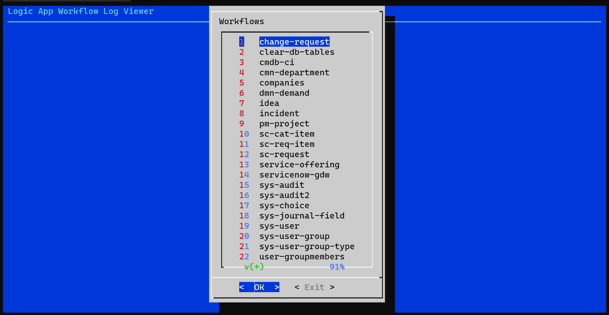
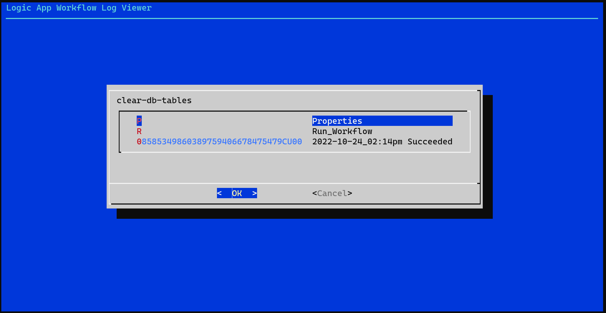
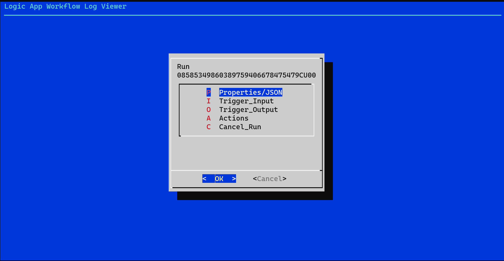
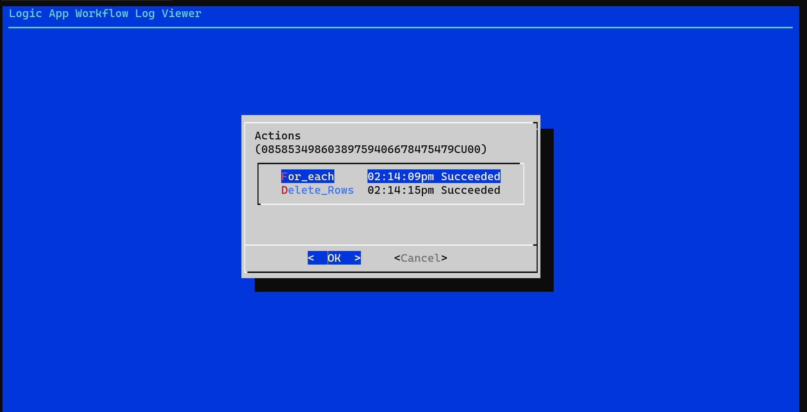
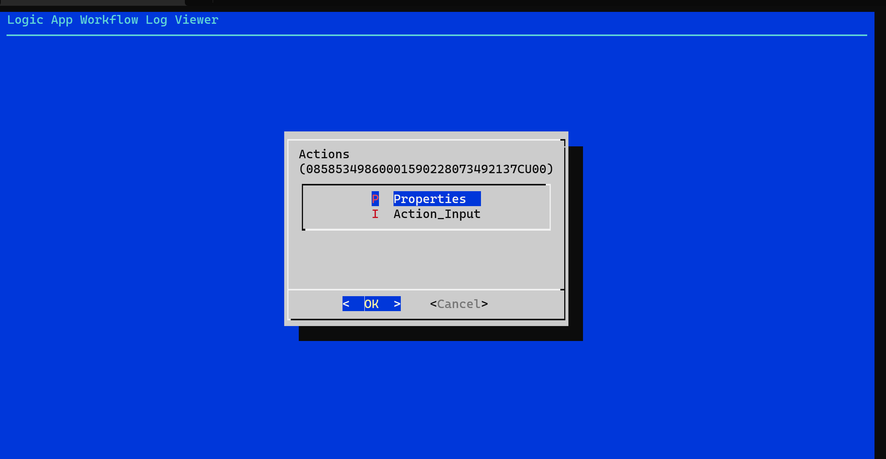
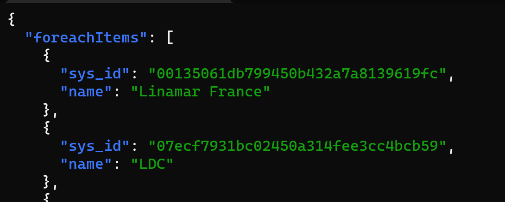

# logicapp-logviewer

## Summary
Allows navigating a Single-Tenant Logic App (Standard) in your VSCode development environment or when deployed to your local Kubernetes (ie. MicroK8S or other) environment.

## Install
Simply run the following to install globally.

````
npm install -g logicapp-logviewer
````

## Running
If installed globally, to run, simply type:

````
logicapp-logviewer
````

When running in your local Kubernetes environment, the AzureWebJobsSecretStorageType should be set to "kubernetes" (ie. the master key should be stored in a Kubernetes secret).

It should also work in "Files" mode, but this is not as thoroughly tested.  When running in your local VSCode development environment, it reads the API key through the workflows REST API at http://localhost:7071

As well, you can pass in the BASEURL and APICODE if they are not detected correctly.

eg.

````
BASEURL=http://localhost APICODE=mymasterkey logicapp-logviewer
````

## Screenshots













## Dependencies
- Only supports install on Linux (Debian/Ubuntu/WSL2-Ubuntu/Docker/etc)
- Depends on the following packages:
  - [dialog](https://dickey.his.com/dialog/)
  - [curl](https://curl.se/)
  - [jq](https://stedolan.github.io/jq/)
  - [less](http://www.greenwoodsoftware.com/less/)
